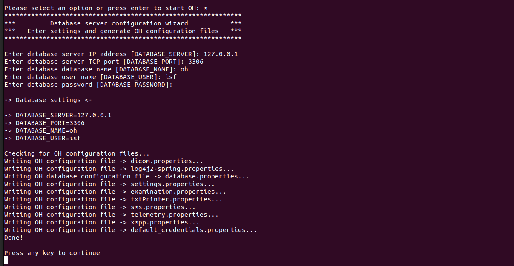

# OH Bundle installation

In this guide:

1. Prerequisites and useful information
2. Installation of the Desktop version (server)
3. Installation of the Web version (server)
4. Installation of the Desktop version (client)
5. Access the Web version (client)
6. Stay up-to-date

### 1. Prerequisites and useful information

At the time of writing, the web version of Open Hospital is experimental and there is no official guide. So the guide shows how to build the web version from sources on GitHub and install it alongside with the Desktop version.


This guide is intended for users wishing to install Open Hospital on Linux-based OS, for instance Ubuntu, and Windows.

**N.B.: This guide only works for Open Hospital 1.14.2 and later.**


### 2. Installation of the Desktop version

For the current latest stable, v.1.4.2, there's an installation guide for the Desktop version. So, this guide will only highlights the parts of the installation that affect the installation of the Web version. Here are steps to follow:

#### 2.1. Download Open Hospital zip from GitHub

The official releases of Open Hospital are hosted on GitHub at [https://github.com/informatici/openhospital/releases](https://github.com/informatici/openhospital/releases). If you're using Ubuntu, download the `multiarch` release, otherwise download the version that matches your Operating System.

#### 2.2. Extract the archive

You can use the built-in `zip` library[ ](https://www.win-rar.com/predownload.html)or any other program that can extract zip archives. If you're using `unzip`  library, open the Terminal  (`Ctrl+Alt+T`) and move to the folder were you have downloaded Open Hospital and execute the following command:



```bash
$ unzip -d /opt/openhospital/ OpenHospital-{version}-multiarch-client.zip
```


Replace `{version}` with version of Open Hospital you're installing. E.g.: `OpenHospital-v1.14.2-multiarch-client.zip`




Use your favorite zip tool to unzip the archive and move it to the folder you want to keep OpenHospital, e.g. `C:\OpenHospital`



#### 2.3. Download and install MariaDB 10.6.16



Follow this guide from the[ official MariaDB documentation](https://mariadb.com/docs/server/deploy/topologies/single-node/community-server-10-6/) to install MariaDB. After the installation, you can use `sudo mariadb-secure-installtion` to secure your DBMS.


Use MariaDB, not MySQL.  You need to apply a specific configuration that MySQL on Linux (Ubuntu) doesn't support. For example, enable `lower_case_table_names` will prevent MySQL from starting.




Follow this guide from the [official MariaDB documentation](https://mariadb.com/kb/en/installing-mariadb-msi-packages-on-windows/) to install MariaDB.



#### 2.4. Configure MariaDB

By default, table names and column names on Linux are case sensitive. You need to enable `lower_case_table_names` and change other MySQL settings to make Open Hospital work smoothly.&#x20;

Use this [part of Open Hospital admin manual](https://github.com/informatici/openhospital-doc/blob/develop/doc\_admin/AdminManual.adoc#2132-mariadbmysql---configuration) to apply these settings.

#### 2.5. Create a database and user for Open Hospital

Open the Terminal (`Ctrl+Alt+T`  - Ubuntu ) and move to the directory containing Open Hospital, probably `/opt/openhospital/`  (Ubuntu) or `C\OpenHospital` (Windows), then move to `sql` directory:



```bash
/opt/openhospital$ cd sql/
```



```sh
C:\OpenHospital> cd sql
```



You can follow the [admin manual](https://github.com/informatici/openhospital-doc/blob/develop/doc\_admin/AdminManual.adoc#214-oh---database-creation) to complete the creation of the database and the user.&#x20;


Keep in mind or note it somewhere:

* The database user's name
* The database name
* The database host name
* The database user's password

You're going to use the same config while installing the web version.


#### 2.6. Create Open Hospital database structure

Next, you have to connect to MariaDB and create Open Hospital database structure by executing the main script:



```bash
/opt/openhospital/sql$ mysql -u root -p [-h hostname/ip address]
Enter password: *****

MariaDB> use oh; source create_all_en.sql;
```



```sh
C:\OpenHospital\sql> mysql -u root -p [-h hostname/ip address]
Enter password: *****

MariaDB [(none)]> use oh; source create_all_en.sql;
```



Wait for the script to complete.

#### 2.7. Execute Open Hospital configuration script

Navigate back to Open Hospital root directory and execute oh.sh script:



```bash
/opt/openhospital$ ./oh.sh
```


**Do not run the command as `sudo`**




```sh
C:\OpenHospital> .\oh.bat
```


**Do not run the command as the Administrator**




After executing this script, the following output will show:

<figure><figcaption><p>OH installer main menu</p></figcaption></figure>

Use the option `E` to show advanced options

<figure><figcaption><p>OH installer advance options</p></figcaption></figure>

Use option `m` to manually configure the database connection. The press `Enter` to go back to the menu.

<figure><figcaption><p>OH manual configuration of the database</p></figcaption></figure>

Next, you have to test the connection to the database. Use the option `t` :

<figure><figcaption><p>oh database connection test</p></figcaption></figure>

If you have the same output, you can continue by creating a desktop shortcut, otherwise check and fix database connection issues you're facing before you continue.

Use option `u` to create the desktop shortcut.

<figure><figcaption></figcaption></figure>

Go to your Desktop and double-click on the shortcut you've created to start Open Hospital. If you encounter permissions issues as shown in the image below (Ubuntu), follow your Operating System recommendations to fix them.

<figure><figcaption></figcaption></figure>

Here's a short tutorial that shows how to start Open Hospital (on Ubuntu) for the first time when you have permissions issues:

<figure><figcaption><p>fix permission issue on OH desktop shortcut</p></figcaption></figure>

And that's it. You've finished the installation of the desktop version of Open Hospital on your server.

### 3. Installation of the web version (server)

To install Open Hospital web version, we'll need to download sources from official repositories on GitHub and build them. Open Hospital requires Java 17 or newest version and uses Maven as package manager. You'll also need Node.js 14 or newest version to build the UI (User Interface).

#### 3.1. Build Open Hospital Web API and UI

If you have [Git](https://git-scm.com/book/en/v2/Getting-Started-Installing-Git) installed, use it to clone the Open Hospital [Core](https://github.com/informatici/openhospital-core) and [API](https://github.com/informatici/openhospital-api) from GitHub:



<pre class="language-bash"><code class="lang-bash">/opt/openhospital$ git clone https://github.com/informatici/openhospital-core.git \
                    &#x26;&#x26; git clone https://github.com/informatici/openhospital-api.git

<strong># Checkout to the tag that is compatible with the desktop application version 
</strong># you've installed. If you've installed v1.14.2, then checkout to the tag v1.14.2
/opt/openhospital$ cd openhospital-core &#x26;&#x26; git checkout v1.14.2
/opt/openhospital$ cd openhospital-api &#x26;&#x26; git checkout v1.14.2
</code></pre>



```sh
C:\OpenHospital> git clone https://github.com/informatici/openhospital-core.git \
C:\OpenHospital> git clone https://github.com/informatici/openhospital-api.git

# Checkout to the tag that is compatible with the desktop application version 
# you've installed. If you've installed v1.14.2, then checkout to the tag v1.14.2
C:\OpenHospital> cd openhospital-core && git checkout v1.14.2
C:\OpenHospital> cd openhospital-api && git checkout v1.14.2
```



If you don't have Git installed, you can download source archives: [Core](https://github.com/informatici/openhospital-core/archive/refs/heads/develop.zip) and [API](https://github.com/informatici/openhospital-api/archive/refs/heads/develop.zip). When the download is completed, extract the zip files.


Make sure to download the version that is compatible with the desktop application version you've installed. If you've installed v1.14.2, download the same version for the [CORE](https://github.com/informatici/openhospital-core/tags) and [API](https://github.com/informatici/openhospital-api/tags).


Next navigate to the Core source code root directory and run `./mvnw clean install`  (for Ubuntu), and `.\mvnw.cmd clean install` , or if you have Maven installed system wide, you can run `mvn clean install` instead.



```bash
/opt/openhospital$ cd openhospital-core
/opt/openhospital/openhospital-core$ ./mvnw clean install
```



```powershell
C:\OpenHospital> cd openhospital-core
C:\OpenHospital\openhospital-core> .\mvnw.cmd clean install -DskipTests
```



Wait for the build to complete and after, navigate to the API source code root directory.



<pre class="language-bash"><code class="lang-bash"><strong>/opt/openhospital/openhospital-core$ cd ../openhospital-api
</strong></code></pre>



```powershell
C:\OpenHospital\openhospital-core> cd ..\openhospital-api
```



Rename `.dist` files in the folder `rsc`.



```bash
/opt/openhospital/openhospital-api/rsc$ mv application.properties.dist application.properties
/opt/openhospital/openhospital-api/rsc$ mv database.properties.dist database.properties
/opt/openhospital/openhospital-api/rsc$ mv log4j2-spring.properties.dist log4j2-spring.properties
/opt/openhospital/openhospital-api/rsc$ mv settings.properties.dist settings.properties
```



```powershell
C:\OpenHospital\openhospital-api\rsc> ren application.properties.dist application.properties
C:\OpenHospital\openhospital-api\rsc> ren database.properties.dist database.properties
C:\OpenHospital\openhospital-api\rsc> ren log4j2-spring.properties.dist log4j2-spring.properties
C:\OpenHospital\openhospital-api\rsc> ren settings.properties.dist settings.properties
```



Update the config file `rsc/application.properties` to set the JWT secret. You can use any text editor (e.g.: `gedit`)


Your JWT secret must be at least **65 characters**.


Next you have to set the database configuration in the config `database.properties`. You must use the same configuration you specified on section [2.5](oh-bundle-installation.md#id-2.5.-create-a-database-and-user-for-open-hospital). When it's done, now build the API using `./mvnw clean install`:



```bash
/opt/openhospital/openhospital-api$ ./mvnw clean install
```



```sh
C:\OpenHospital\openhospital-api> .\mvnw.cmd clean install -DskipTests
```



Wait for the build to finish.

At this level you can start the API to ensure that the configuration you've applied is correct. Move to `target` folder and run the following command, as specified in the official documentation, to start the API:



```bash
/opt/openhospital/openhospital-api$ cd target
/opt/openhospital/openhospital-api/target$ java -cp "openhospital-api-0.1.0.jar:rsc/:static/" org.springframework.boot.loader.launch.JarLauncher
```



```powershell
C:\OpenHospital\openhospital-api> cd target
C:\OpenHospital\openhospital-api\target> java -cp "openhospital-api-0.1.0.jar;rsc/;static/" org.springframework.boot.loader.launch.JarLauncher
```



If you see the following output, you've successfully built the API.

<figure><figcaption><p>Starting OH API output</p></figcaption></figure>

Stop the API using `Ctrl+C.`

The next step is to build the UI. You need to have [Node.js](https://nodejs.org/en) 14 or latest version installed. Here's how to install Node.js 20:



```bash
# installs nvm (Node Version Manager)
curl -o- https://raw.githubusercontent.com/nvm-sh/nvm/v0.40.0/install.sh | bash

# download and install Node.js (you may need to restart the terminal)
nvm install 20

# verifies the right Node.js version is in the environment
node -v # should print `v20.17.0`

# verifies the right npm version is in the environment
npm -v # should print `10.8.2`
```



Download [Node.js installer for Windows](https://nodejs.org/dist/v20.17.0/node-v20.17.0-x64.msi) and use it to install Node.js



Navigate to the UI source code root directory, install dependencies and build it.



```bash
/opt/openhospital/openhospital-api$ cd ../openhosptial-ui

# Checkout to the tag that is compatible with the desktop application version 
# you've installed. If you've installed v1.14.2, then checkout to the tag v1.14.2
/opt/openhospital/openhospital-ui$ git checkout v1.14.2

# Install dependencies
/opt/openhospital/openhospital-ui$ npm i

# Here we use the environment variable REACT_APP_BASE_PATH to set the address of the backend
# Assuming the API will be running on port 8082, use the following command tu build the UI
/opt/openhospital/openhospital-ui$ REACT_APP_BASE_PATH=http://{ip-address}:8082 npm run build --prod
```



```powershell
C:\OpenHospital\openhospital-api> cd ..\openhosptial-ui

# Checkout to the tag that is compatible with the desktop application version 
# you've installed. If you've installed v1.14.2, then checkout to the tag v1.14.2
C:\OpenHospital\openhospital-ui> git checkout v1.14.2

# Install dependencies
C:\OpenHospital\openhospital-ui> npm i

# Here we use the environment variable REACT_APP_BASE_PATH to set the address of the backend
# Assuming the API will be running on port 8082, use the following command tu build the UI
C:\OpenHospital\openhospital-ui> $env:REACT_APP_BASE_PATH="http://{ip-address}:8082"; npm run build --prod
```




`{ip-address}` is the IP address of the server in your network


Wait for the build to finish. Then try to start the UI using `serve` :&#x20;



```bash
# Install serve
/opt/openhospital/openhospital-ui$ npm install -g serve

# Run the build of OpenHospital UI using serve
/opt/openhospital/openhospital-ui$ serve -s build -p 3000
```



```powershell
# Install serve
C:\OpenHospital\openhospital-ui> npm install -g serve

# Run the build of Open Hospital UI using serve
C:\OpenHospital\openhospital-ui> serve -s .\build -p 3000
```



Open your browser and navigate to http://localhost:3000, you should see the login page of Open Hospital.

#### 3.2. Create a service to automatically start the API

Now create a service so that you can add it to the services daemon (`systemd` - Ubuntu) to easily manage the Open Hospital API.



Start by creating the `openhospitalapi.service` in the folder `/etc/systemd/system/`  with the content:

```bash
[Unit]
Description=Open Hospital API
After=syslog.target network.target

[Service]
User=root
Group=root

ExecStart=/opt/openhospital/build/start-api.sh
ExecStop=/bin/kill -15 $MAINPID
SuccessExitStatus=143
RestartSec=10

[Install]
WantedBy=multi-user.target
```

Next create the folder `build` in which you create the file `start-api.sh`

```bash
/opt/openhospital$ mkdir build && cd build
/opt/openhospital/build$ gedit start-api.sh
```

In this file, add the following lines:

```
#!/bin/sh

SERVER_PORT=8082
SERVER_ADDRESS=0.0.0.0

cd /opt/openhospital/build/api/

java -cp "openhospital-api-0.1.0.jar:rsc/:static/" org.springframework.boot.loader.launch.JarLauncher \
        --server.port=$SERVER_PORT
        --server.address=0.0.0.0
```


Here we define the port to **8082**, and the address to 0.0.0.0, so Open Hospital API will be available on this port and both via `localhost` or the IP address.&#x20;


Make that file executable:

```bash
/opt/openhospital/build$ chmod +x start-api.sh
```

Now create a folder in the `build` folder and name it `api`:

```bash
/opt/openhospital/build$ mkdir api
```

From the folder `/opt/openhospital/openhospital-api/target/` copy the built files and folders `openhospital-api-0.1.0.jar`, `static/` and `rsc/`&#x20;

```bash
/opt/openhospital/build/api$ cp /opt/openhospital/openhospital-api/target/openhospital-api-0.1.0.jar .
/opt/openhospital/build/api$ cp -r /opt/openhospital/openhospital-api/target/rsc .
/opt/openhospital/build/api$ cp -r /opt/openhospital/openhospital-api/target/static .
```

Now try to start Open Hospital API using the bash script you've just created:

```bash
/opt/openhospital/build$ ./start-api.sh
```

You should see the output:

<figure><figcaption><p>Starting Open Hospital API output</p></figcaption></figure>

Stop the API using `Ctrl+C`, then try to start Open Hospital API using the system daemon:

```bash
/opt/openhospital/build$ sudo systemctl start openhospitalapi
```

Wait a few seconds (about 30 seconds), the time for the service to start and use `status` option to check if the service has started:

```bash
/opt/openhospital/build$ sudo systemctl status openhospitalapi
```

You should see the output:

<figure><figcaption><p>OH API service status</p></figcaption></figure>

Open the browser and enter the URL `http://[localhost | {ip-address}]:8082/swagger-ui/index.html`. You should see the API specs.

<figure><figcaption><p>OH API Swagger UI</p></figcaption></figure>

Finally, we enable the Open Hospital API service in system daemon so that it will start automatically on computer startup.

```bash
/opt/openhospital/build$ sudo systemctl enable openhospitalapi
```



Start by downloading [NSSM](https://nssm.cc/release/nssm-2.24.zip). Next unzip and move it to `C:` drive (`C:\nssm-2.24\`).

Move to NSSM folder:

```powershell
cd C:\nssm-2.24\win64>
```

Run the command to install a service for Open Hospital API:

```
C:\nssm-2.24\win64> .\nssm.exe install OpenHospitalAPI
```

The NSSM service installer window will show. Fill it with the following information:

In the Application tab:

* Path: `C:\Program Files\Java\jdk-17.0.4.1\bin\java.exe` (Path to your Java executable)&#x20;
* Startup directory: `C:\OpenHospital\openhospital-api\target` (Path to the folder where OpenHospital build is located)
* Arguments: `-cp "openhospital-api-0.1.0.jar;rsc/;static/" org.springframework.boot.loader.launch.JarLauncher --server.port=8082 --server.address=0.0.0.0 --api.host=localhost:8082 --api.protocol=http`&#x20;

In the Details tab:

* Display name: Open Hospital API
* Description: Lightweight, RESTful API server for Open Hospital
* Startup type: Make sure `Automatic` is selected

Here are the different tabs:

<figure><figcaption><p>Application tab</p></figcaption></figure>

<figure><figcaption><p>Details tab</p></figcaption></figure>

Then click on the button `Install service`. You should see a windows informing you that the service has been installed.

<figure><figcaption><p>OpenHospital API service successfully installed</p></figcaption></figure>

Next open Windows Services Manager. You can use the shortcut `Windows+R` and enter `services.msc`:

<figure><figcaption><p>Open Windows Services Manager</p></figcaption></figure>

Locate OpenHospital API service in Windows Services Manager, right click on it and start the service.

<figure><figcaption><p>Start OpenHospital API service</p></figcaption></figure>

Wait a few seconds (about 40 seconds), then open the browser and enter the URL `http://[localhost | {ip-address}]:8082/swagger-ui/index.html`. You should see the API specs.

<figure><figcaption><p>OH API Swagger UI</p></figcaption></figure>





#### 3.3. Use PM2 to automatically start the UI

To run the Open Hospital UI, we will use [serve](https://www.npmjs.com/package/serve).

Copy everything in the build folder in Open Hospital UI source code folder to the folder `ui`:



```bash
/opt/openhospital/build$ mkdir ui && cd ui
/opt/openhospital/build/ui$ cp -r /opt/openhospital/openhospital-ui/build/* .
```



```powershell
C:\OpenHospital> New-Item -Path "build" -ItemType Directory
C:\OpenHospital> New-Item -Path "build\ui" -ItemType Directory
C:\OpenHospital> Copy-Item -Path ".\openhospital-ui\build\*" -Destination ".\build\ui\" -Recurse
```



Try to run the UI using serve:



```bash
/opt/openhospital/build/ui$ cd ..
/opt/openhospital/build$ serve -s ui -p 3000
```



```powershell
C:\OpenHospital> cd build
C:\OpenHospital\build> serve -s .\ui -p 3000
```



Open your browser and navigate to http://localhost:3000. If you see Open Hospital login page, you're able to run the UI. Then stop the process using `Ctrl+C`.

Next, configure Open Hospital UI to automatically start on computer startup.



&#x20;Install pm2 and use it to automatically start the UI on computer startup:&#x20;

```bash
# Install pm2
$ npm install pm2@latest -g

# Make pm2 to start automatically on computer startup
$ pm2 startup

# Start Open Hospital UI using pm2
/opt/openhospital/build$ pm2 start "serve -s ui -l 3000" -n "OpenHospital UI"

# Synchronize the process with saved list
/opt/openhospital/build$ pm2 save
```



Use NSSM to install OpenHospital UI service.

Move to NSSM folder:

```powershell
cd C:\nssm-2.24\win64>
```

Run the command to install a service for Open Hospital API:

```
C:\nssm-2.24\win64> .\nssm.exe install OpenHospitalUI
```

The NSSM service installer window will show. Fill it with the following information:

In the Application tab:

* Path: `/path/to/serve/executable` (Path to `serve` executable)&#x20;

If you've installed Node.js using the windows installer, `serve` executable is more likely to be located at `C:\Program Files\nodejs\serve.cmd`. &#x20;

If you've installed Node.js using `nvm`, to find the path to serve executable, open the file explorer and paste `%NVM_SYMLINK%` in the location bar and press `Enter`.

<figure><figcaption><p>Locate serve executable - part 1</p></figcaption></figure>

<figure><figcaption><p>Locate serve executable - part 2 </p></figcaption></figure>

The path to serve executable will `C:\Users\[user]\AppData\Roaming\nvm\[your-node-version]\serve.cmd`.

* Startup directory: `C:\OpenHospital\build` (Path to the folder where Open Hospital UI build is located)
* Arguments: `-s .\ui -l 3000`&#x20;

In the Details tab:

* Display name: Open Hospital UI
* Description: Open Hospital Modern UI built with ReactJS
* Startup type: Make sure `Automatic` is selected

Then click on the button `Install service`. Next go to Windows Services Manager and start the service OpenHospitalUI (same as you previously did for Open Hospital API service).



Open your browser and navigate to http://localhost:3000. If you see Open Hospital login page, you're done with the automation.

### 4. Installation of the Desktop version (client)

Installing Open Hospital Desktop on client workstations is quite simple. Copy the zip you downloaded on section [#id-2.1.-download-open-hospital-zip-from-github](oh-bundle-installation.md#id-2.1.-download-open-hospital-zip-from-github "mention") and paste it in the client workstation, let's say at `/opt/openhospital` (Ubuntu) or `C:\OpenHospital` (Windows). &#x20;

Next, unzip the archive and execute Open Hospital configuration script:



```bash
/opt/openhospital/OpenHospital-v1.14.2-multiarch-client$ sudo chmod + oh.sh
/opt/openhospital/OpenHospital-v1.14.2-multiarch-client$ ./oh.sh
```



```powershell
C:\OpenHospital\OpenHospital-v1.14.2-multiarch-client> .\oh.bat
```



Use the section [2.7](oh-bundle-installation.md#id-2.7.-execute-openhospital-configuration-script) to finish the installation.

### 5. Accessing the Web version (client)

Accessing Open Hospital Web in client workstations (any other workstation in the network different from the server) is straightforward. Open the browser and enter the IP address of the server follow by colon (`:`) and the port on which Open Hospital UI is running.

```
http://{ip-address}:{port}
```


E.g.: `http://192.168.1.12:3000`


### 6. Stay up-to-date

Open Hospital Dev team is actively working on providing a simple installation setup. This documentation is just a workaround until a simpler and official guide is produced.

To keep your Open Hospital installation up-to-date, subscribe to mailing list to get notified when a new version is released. When a new version is released, migrate the database if there's any migrations, then re-apply all the steps excluded the step [2.3](oh-bundle-installation.md#id-2.3.-download-and-install-mariadb-10.6.16) to [2.6](oh-bundle-installation.md#id-2.6.-create-open-hospital-database-structure).


